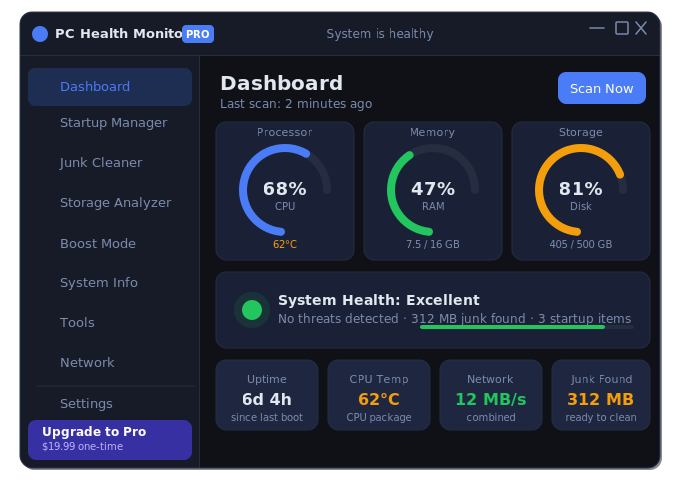

# PC Health Monitor

> **A modern, dark-themed Windows system optimization suite** — built with WPF (.NET 8), MVVM, and dependency injection. Lightweight, admin-free, and designed for power users who demand clarity and control.



---

## ✨ Features

### 🏠 Dashboard
Real-time system health overview with animated arc gauges for CPU, RAM, and disk usage. Live temperature monitoring, uptime display, and a one-click **Scan Now** button that surfaces junk, startup impact, and storage issues at a glance.

### 🧹 Junk Cleaner
Scans and cleans multiple junk categories in parallel:
- Temporary files (`%TEMP%`, Windows Temp)
- Browser cache (Chrome, Edge, Firefox)
- Recycle Bin
- Windows Update cache
- Thumbnail cache
- Event logs

Each category shows its estimated size before cleaning. Select all or individual categories and clean with a single click. Runs a silent auto-cleanup when launched with `/silent` (see Scheduler below).

### 🚀 Startup Manager
Lists all Windows startup entries (Registry + Startup folder) with:
- Live enable/disable toggle (checkbox)
- Publisher information
- Impact badge (Low / Medium / High)
- **Remove from Startup** button — active when the entry is enabled; instantly removes it from the startup registry with one click

### 📦 Storage Analyzer
Scans the user's home folder and drive root to surface the largest folders and files. Smart scan engine:
- Skips system directories (`Windows`, `Program Files`, etc.) for speed and safety
- Hard 10-second timeout — never hangs
- Displays top items sorted by size with human-readable labels

### ⚡ Boost Mode
Select any currently running application and elevate it to **Above Normal** CPU and I/O priority for a configurable duration (5–120 minutes). When the timer expires, priority is automatically restored.
- Live process list sorted by RAM usage
- Avatar initial + process name + memory display
- Green **BOOST ACTIVE** banner with countdown while boosting
- Restores previous priority on deactivation or app exit

### 🖥 System Info
Admin-free hardware overview assembled from Registry, WMI, and .NET APIs:
- **CPU** — model, core count, live load bar, temperature
- **RAM** — total size, speed (MHz), live usage bar
- **OS** — version, uptime, machine name, user, architecture
- **GPU** — model name, VRAM
- **Storage** — all drives with usage bars, free space, file system type

### 🔧 Tools
Quick-access Windows utilities: Disk Cleanup, Defragment, Device Manager, System Restore, msconfig, and more — launched directly from the app.

### 🌐 Network
Live network adapter stats, connection info, and speed indicators.

### ⚙️ Settings
Auto-cleanup scheduling, theme preferences, notification settings, and license management.

---

## 🗓 Scheduled Auto-Cleanup (`/silent` mode)

PC Health Monitor supports a **headless cleanup mode** for Task Scheduler integration:

```
PCHealthMonitor.exe /silent
```

When launched with `/silent`:
1. Scans all junk categories
2. Cleans everything found
3. Shows a **system tray balloon notification** with the result (e.g. *"Auto-cleanup complete · 312.4 MB freed"*)
4. Writes a log entry to `%LocalAppData%\PCHealthMonitor\Logs\cleanup.log`
5. Exits automatically

**Setting up a weekly scheduled task (PowerShell — run as Administrator):**

```powershell
$action  = New-ScheduledTaskAction -Execute "C:\Users\rotem\OneDrive\Desktop\clean bot\PCHealthMonitor-v2\PCHealthMonitor\bin\Release\net8.0-windows\win-x64\publish\PCHealthMonitor.exe" -Argument "/silent"
$trigger = New-ScheduledTaskTrigger -Weekly -DaysOfWeek Sunday -At 9am
$settings = New-ScheduledTaskSettingsSet -ExecutionTimeLimit (New-TimeSpan -Minutes 5)
Register-ScheduledTask -TaskName "PCHealthMonitor AutoClean" -Action $action -Trigger $trigger -Settings $settings -RunLevel Limited -Force
```

---

## 🏗 Architecture

| Layer | Tech |
|-------|------|
| UI Framework | WPF / XAML (.NET 8) |
| Pattern | MVVM + CommunityToolkit.Mvvm |
| DI Container | Microsoft.Extensions.Hosting |
| Hardware Monitoring | LibreHardwareMonitor |
| System Tray | Hardcodet.Wpf.TaskbarNotification |
| System Data | WMI (`Win32_*`), Registry, `DriveInfo` |

**Key design decisions:**
- All views are **singletons** — no timer leaks on tab navigation
- `JournalOwnership="OwnsJournal"` on the Frame — back stack cleared after every navigation
- All heavy I/O runs in `Task.Run` — UI thread never blocked
- WMI queries use explicit `Options.Timeout` + `CancellationTokenSource` — no infinite hangs
- `/silent` mode runs with `ShutdownMode = OnExplicitShutdown` — no window, no splash

---

## 🚀 Getting Started

### Prerequisites
- Windows 10 / 11 (x64)
- [.NET 8 Runtime](https://dotnet.microsoft.com/download/dotnet/8.0)

### Build from source

```powershell
# Clone
git clone https://github.com/your-repo/PCHealthMonitor.git
cd "PCHealthMonitor-v2"

# Debug build
dotnet build "PCHealthMonitor\PCHealthMonitor.csproj" -c Debug

# Release publish (self-contained)
dotnet publish "PCHealthMonitor\PCHealthMonitor.csproj" -c Release -r win-x64 --self-contained false
```

### Run

```powershell
# Normal mode
.\PCHealthMonitor\bin\Debug\net8.0-windows\PCHealthMonitor.exe

# Headless auto-cleanup mode
.\PCHealthMonitor\bin\Debug\net8.0-windows\PCHealthMonitor.exe /silent
```

---

## 📁 Project Structure

```
PCHealthMonitor/
├── Assets/                  # Icons, preview image
├── Services/
│   ├── HardwareService.cs   # LibreHardwareMonitor wrapper (live CPU/RAM/temp)
│   ├── CleanerService.cs    # Junk scan + clean engine
│   ├── StorageService.cs    # Large-items scanner (smart, timed)
│   ├── BoostService.cs      # Process priority manager
│   ├── SystemInfoService.cs # Admin-free hardware snapshot
│   ├── SchedulerService.cs  # Startup entry read/write
│   ├── NetworkService.cs    # Network adapter stats
│   ├── BoostService.cs      # CPU/IO priority booster
│   └── ...
├── ViewModels/              # MVVM ViewModels (one per view)
├── Views/
│   ├── Dashboard/
│   ├── Startup/
│   ├── JunkCleaner/
│   ├── Storage/
│   ├── Boost/
│   ├── DiskHealth/          # System Info tab
│   ├── Tools/
│   ├── Network/
│   └── Settings/
├── App.xaml.cs              # DI host, /silent mode, crash logging
└── MainWindow.xaml          # Chrome, sidebar, tray icon
```

---

## 📝 Logs

| File | Content |
|------|---------|
| `%LocalAppData%\PCHealthMonitor\Logs\crash.log` | Unhandled exceptions with stack traces |
| `%LocalAppData%\PCHealthMonitor\Logs\cleanup.log` | Silent auto-cleanup history (date, MB freed, categories) |

---

## 🛡 Safety

- **Zero-destruction policy** — never deletes system files or registry keys without explicit user action
- All destructive operations target folder *contents* (e.g. `Temp\*`), never the folder itself
- S.M.A.R.T. and admin-requiring features have been replaced with admin-free equivalents
- Startup entries are disabled, not deleted — fully reversible

---

*Built with ❤️ — April 2026*
