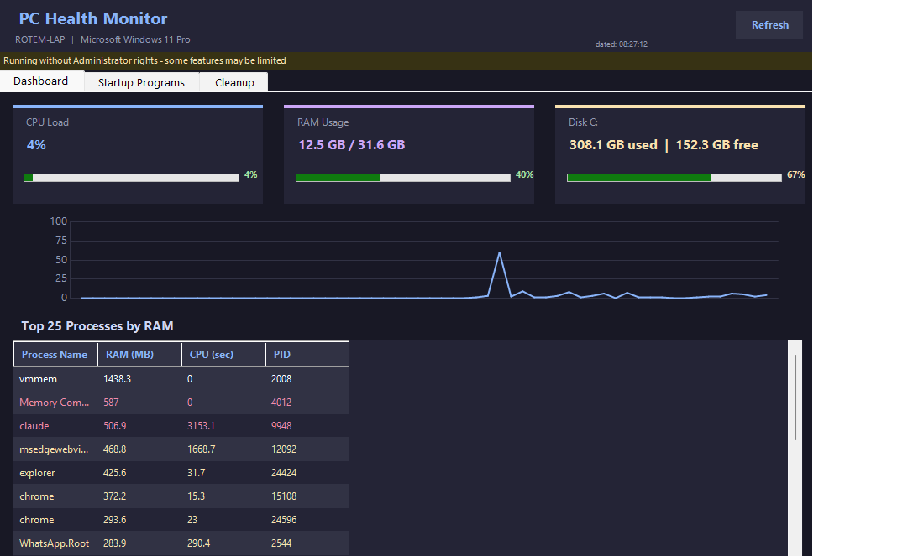
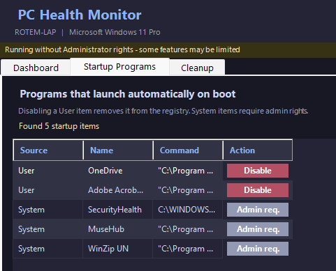
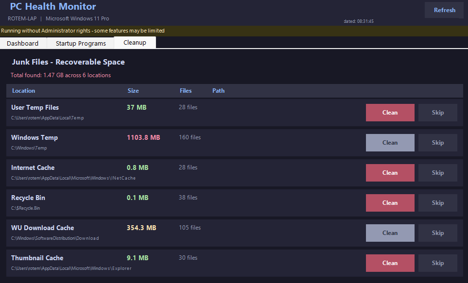

# PC Health Monitor

<div align="center">


**A lightweight, real-time PC monitoring and cleanup tool built entirely in PowerShell.**
No installation required. No third-party dependencies. Just run and go.

</div>

---

## Preview

<div align="center">
<table>
  <tr>
    <th align="center">📊 Dashboard</th>
    <th align="center">🚀 Startup Manager</th>
    <th align="center">🧹 Junk File Cleaner</th>
  </tr>
  <tr>
    <td align="center">
      <a href="screenshots/dashboard.png">
        
      </a>
    </td>
    <td align="center">
      <a href="screenshots/startup.png">
        
      </a>
    </td>
    <td align="center">
      <a href="screenshots/cleanup.png">
        
      </a>
    </td>
  </tr>
</table>

*Click any image to view full size*

</div>

---

## Why This Tool?

Most PC optimizers are bloated with ads, telemetry, and unnecessary dependencies. PC Health Monitor offers a clean alternative:

- **Zero dependencies** — pure PowerShell + Windows Forms, nothing to install
- **100% transparent** — open source, what you see is what runs
- **Privacy first** — no background data collection, everything stays local

> The project is still under development (WIP). Feel free to contribute or give feedback!

---

## Features

**Real-Time Dashboard**
- Live CPU, RAM, and Disk usage cards with color-coded progress bars
- Auto-refresh every 3 seconds with last-updated timestamp
- Live CPU history chart (last 60 seconds)
- Top 25 processes ranked by RAM, color-coded by severity

**Startup Manager**
- Lists all programs that launch on boot (User and System registry hives)
- One-click Disable button removes startup items directly from the registry
- Requires Administrator for System-level items

**Junk File Cleaner**
- Scans 6 locations with size and file count breakdown
- Clean per location or Clean All in one shot
- Safe cleanup — deletes contents only, never root folders
- Async operation so the UI stays responsive during cleanup

**System Tray**
- Minimizes to tray instead of closing
- Right-click menu: Open / Exit
- Smart alerts when CPU exceeds 85%, RAM exceeds 85%, or Disk exceeds 90%

**Security**
- Detects if running without Administrator rights
- Disables buttons that require elevation with a clear warning banner

---

## Requirements

| Component | Requirement |
|-----------|-------------|
| OS | Windows 10 or 11 |
| PowerShell | 5.1 or higher (built into Windows) |
| Permissions | Standard user (Admin recommended for full cleanup) |

---

## Getting Started

**1. Clone or download**

```bash
git clone https://github.com/Rzuss/PC-Health-Monitor.git
```

**2. Create the Desktop shortcut (first time only)**

Double-click `Create-Desktop-Shortcut.bat`

This creates a silent launcher and places a shortcut on your Desktop.

**3. Launch**

Double-click the **PC Health Monitor** shortcut on your Desktop.

> For full cleanup access, right-click the shortcut and select **Run as Administrator**.

---

## File Structure

```
PC-Health-Monitor/
|
|-- PC-Health-Monitor.ps1          # Main GUI application
|-- PC-Cleanup-Rotem.ps1           # Standalone cleanup script
|-- Create-Desktop-Shortcut.ps1    # Shortcut creation logic
|-- Create-Desktop-Shortcut.bat    # Run this once to set up
|-- Launch-Monitor.vbs             # Silent launcher (auto-generated)
|-- screenshots/                   # App screenshots for README
|-- README.md
|-- CLAUDE.md
```

---

## Planned Features

- [ ] Network tab — active connections and processes communicating outbound
- [ ] Hardware health — CPU temperature, S.M.A.R.T. disk status, battery info
- [ ] Security tab — Defender status, missing Windows updates
- [ ] Duplicate file scanner
- [ ] Unused software detector (not launched in 90+ days)

---

## Contributing

Contributions, issues, and feature requests are welcome!

1. Fork the repository
2. Create a feature branch: `git checkout -b feature/my-feature`
3. Commit your changes: `git commit -m "Add my feature"`
4. Push to the branch: `git push origin feature/my-feature`
5. Open a Pull Request

---

## License

This project is licensed under the MIT License.

---

<div align="center">
Made with PowerShell on Windows &mdash; by Rotem
</div>
