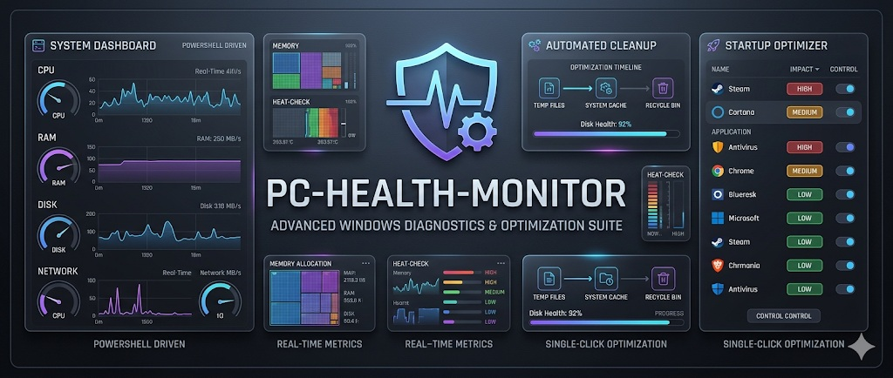

# PC Health Monitor

<div align="center">


**A lightweight, real-time PC monitoring, security, and intelligence tool built entirely in PowerShell.**  
No installation required. No third-party dependencies. Plugin-extensible. Just run and go.

</div>

---

## Quick Install (One-Liner)

```powershell
irm https://raw.githubusercontent.com/Rzuss/PC-Health-Monitor/main/install.ps1 | iex
```

> Installs silently to `%LOCALAPPDATA%\PC-Health-Monitor` and creates a Desktop shortcut.  
> For full access, right-click the shortcut and select **Run as Administrator**.

---

## Preview

<div align="center">

[](screenshots/PC-Health-Monitor.png)

*Click image to view full size — Cyber-HUD dark theme with live gauges, process manager, and network tab*

</div>

---

## Why This Tool?

Most PC optimizers are bloated with ads, telemetry, and unnecessary dependencies. PC Health Monitor offers a clean alternative:

- **Zero dependencies** — pure PowerShell + Windows Forms, nothing to install
- **100% transparent** — open source, what you see is what runs
- **Privacy first** — no background data collection, all threat intelligence stays local
- **Cyber-HUD dark theme** — obsidian background, electric blue + neon purple accents, GDI+ circular gauges
- **System tray integration** — minimize and monitor from taskbar with smart threshold alerts
- **Plugin architecture** — extend with community `.psm1` plugins, no core code changes needed
- **Offline threat intelligence** — 7,600+ C2/botnet IOCs checked locally, zero cloud API calls

> The project is actively developed. New features are being added regularly!

---

## Features

### 🖥️ Real-Time Dashboard
- Live CPU, RAM, and Disk usage with **GDI+ circular gauge cards**
- **Hardware Temperature card** — reads CPU & GPU temps via LibreHardwareMonitor WMI (graceful fallback if LHM is not running)
- Auto-refresh every 3 seconds with last-updated timestamp
- Live CPU history SplineArea chart (last 60 seconds)
- **Top 25 processes by RAM** with color-coded severity and **END button** per process
- **Anomaly detection column** — processes deviating >2.5σ from their 30-day baseline highlighted in magenta
- Runspace-based async refresh — UI never freezes

### 📊 Predictive Health Score *(new in v3.0)*
- Composite **Health Score (0–100)** updated daily via Python analytics engine
- **Predictive alerts**: "Disk C: fills in ~14 days at current rate"
- RAM trend analysis: detects slow memory leaks over weeks
- Weighted scoring: disk fill rate (30%), RAM trend (20%), security posture (25%), startup impact (15%), anomaly count (10%)
- Powered by `health_analyzer.py` — runs as a Windows Scheduled Task at 03:00 AM

### 🧠 Behavioral Baseline Engine *(new in v3.0)*
- Builds a **personal behavioral profile** of every process over 30 days
- Detects anomalies using Z-score statistics — flags processes that deviate from their own normal baseline
- `svchost.exe using 487 MB — +241% above its 30-day average of 143 MB`
- Anomaly column in process grid with one-click detail popup: current vs. baseline, Z-score, suggested causes
- Powered by `baseline_engine.py` — runs as a Windows Scheduled Task at 03:05 AM

### ☠️ Process Manager (Kill)
- **END button** on every process row for one-click termination
- Confirmation dialog before execution (default: No — prevents accidents)
- **Protected process blacklist**: `explorer`, `lsass`, `winlogon`, `csrss`, `dwm`, and more — cannot be terminated
- Permission-aware error messages: different guidance for Standard User vs Administrator
- Immediate process grid refresh after successful kill

### 🌐 Network Intelligence Tab
- Live view of all active TCP connections
- Columns: Process, PID, Local Port, Remote IP, State, **THREAT INTEL** *(new)*
- **State color coding**: ESTABLISHED (blue), LISTEN (green), CLOSE_WAIT (yellow), TIME_WAIT (dim)
- **Suspicious connection highlighting**: non-RFC1918 remote IPs flagged in orange
- **Offline C2 detection** — connections to known botnet/C2 IPs flagged in red with malware family name
- Refreshes every 6 seconds when tab is active — no wasted CPU when hidden

### 🛡️ Offline Threat Intelligence *(new in v3.0)*
- **7,607 C2/botnet IP indicators** sourced from AbuseCH Feodo Tracker and URLhaus
- Covers families: Emotet, Dridex, TrickBot, QakBot, and more
- **Zero runtime API calls** — all lookups are local JSON file checks
- GitHub Actions workflow refreshes the IOC database every Monday at 03:00 UTC automatically
- Status bar shows IOC count and last update date

### 🔌 Plugin Architecture *(new in v3.0)*
- Drop any `.psm1` file into the `/plugins` folder — a new tab appears automatically
- Plugins receive the full Cyber-HUD color palette and a dedicated UI panel
- Included reference plugin: **💾 Disk Health** — S.M.A.R.T. status for all drives via WMI
- Community plugin API documented in `plugins/PLUGIN-API.md`
- Broken plugins never crash the main app — errors are caught and logged

### 🔒 Security Audit Tab
- **Windows Defender** status + last scan date (green/red/yellow indicator)
- **Pending Windows Updates** count with severity color coding
- **Firewall** status per profile: Domain / Private / Public
- **Open Listening Ports** grid with owning process identification
- SCAN NOW button for immediate re-audit
- **EXPORT REPORT** — generates a styled HTML report on the Desktop

### 🚀 Startup Manager
- Lists all programs that launch on boot (User and System registry hives)
- One-click Disable removes startup items directly from the registry
- Instant row removal after successful disable with visual feedback
- Requires Administrator for System-level items (with clear status indicators)

### 🧹 Junk File Cleaner
- Scans 6 locations with size and file count breakdown (Temp, Windows Temp, Internet Cache, Recycle Bin, WU Cache, Thumbnails)
- Clean per location or Clean All in one shot
- Safe cleanup — deletes contents only, never root folders
- Async operation with Marquee progress bar — UI stays responsive
- Real-time status updates and completion notifications

### 🔔 System Tray
- Minimizes to tray instead of closing
- Right-click menu: Open / Exit
- Smart alerts: CPU > 85%, RAM > 85%, Disk > 90%
- Hint popup on first minimize

### 📋 Logging Engine
- Structured log at `%TEMP%\PCHealth-Monitor.log`
- Format: `[YYYY-MM-DD HH:mm:ss] [LEVEL] Message`
- Automatic log rotation at 512 KB
- Session header with OS version, PowerShell version, and privilege level
- Telemetry CSV at `%TEMP%\PCHealth-Telemetry.csv` — feeds the analytics engine
- All error paths log to file — attach log when opening GitHub Issues

---

## Requirements

| Component   | Requirement                                       |
|-------------|---------------------------------------------------|
| OS          | Windows 10 or 11                                  |
| PowerShell  | 5.1 or higher (built into Windows)                |
| Permissions | Standard user (Admin recommended for full access) |
| Python      | 3.8+ with `pandas`, `numpy` (for analytics engine — optional) |
| Optional    | [LibreHardwareMonitor](https://github.com/LibreHardwareMonitor/LibreHardwareMonitor) running for CPU/GPU temps |

---

## Getting Started

**Option A — One-liner (recommended)**

```powershell
irm https://raw.githubusercontent.com/Rzuss/PC-Health-Monitor/main/install.ps1 | iex
```

**Option B — Manual**

```bash
git clone https://github.com/Rzuss/PC-Health-Monitor.git
```

Double-click `Create-Desktop-Shortcut.bat` to create the launcher, then run the **PC Health Monitor** shortcut on your Desktop.

**Option C — Standalone .exe**

```powershell
# Requires PS2EXE module (auto-installed on first run)
.\Build-Exe.ps1
```

Output: `dist\PC-Health-Monitor.exe` — run directly, no PowerShell window required.

**Enable Analytics Engine (optional)**

```powershell
pip install pandas numpy
.\Register-HealthTask.ps1
```

Registers two daily Scheduled Tasks: health scoring at 03:00 AM and baseline profiling at 03:05 AM.

---

## Plugin Development

Drop a `.psm1` file into the `plugins/` folder. The tool auto-discovers it on next launch.

Every plugin must export three functions:

```powershell
function Get-PluginManifest  { @{ Name='My Plugin'; TabName='🔌 My Tab'; Version='1.0'; Author='You' } }
function Initialize-Plugin   { param([System.Windows.Forms.Panel]$ParentPanel, [hashtable]$Colors) }
function Refresh-Plugin      { param([System.Windows.Forms.Panel]$DataPanel) }
```

See `plugins/PLUGIN-API.md` for the full contract and `plugins/smart-disk.psm1` as a reference implementation.

---

## Troubleshooting

If you encounter issues, attach the log file when opening a GitHub Issue:

```
%TEMP%\PCHealth-Monitor.log
```

The log includes OS info, PowerShell version, privilege level, and the full error chain.

---

## File Structure

```
PC-Health-Monitor/
|
|-- PC-Health-Monitor.ps1          # Main GUI application (~1,844 lines, 8 regions)
|-- install.ps1                    # One-liner installer (irm | iex)
|-- Build-Exe.ps1                  # Compile to .exe via PS2EXE
|-- PC-Cleanup-Rotem.ps1           # Standalone cleanup script
|-- health_analyzer.py             # Predictive health score engine (Sprint 6)
|-- baseline_engine.py             # Behavioral anomaly detection (Sprint 7)
|-- Register-HealthTask.ps1        # Register analytics Scheduled Tasks
|-- threat_intel.json              # Offline IOC database (7,600+ C2/botnet IPs)
|-- Create-Desktop-Shortcut.bat    # Legacy shortcut setup
|-- Launch-Monitor.vbs             # Silent launcher (auto-generated)
|-- dist/                          # Compiled .exe output (git-ignored)
|-- screenshots/                   # App screenshots for README
|-- plugins/
|   |-- PLUGIN-API.md              # Plugin development contract
|   |-- smart-disk.psm1            # Reference plugin: S.M.A.R.T. disk health
|-- scripts/
|   |-- build_ioc_db.py            # IOC database builder (used by CI)
|-- .github/
|   |-- workflows/
|       |-- validate.yml           # PSScriptAnalyzer CI on push & PR
|       |-- update-threat-intel.yml # Weekly IOC refresh via GitHub Actions
|-- PC-Health-Monitor-Roadmap.docx # Development roadmap
|-- PC-Health-Monitor-Vision-Sprints.docx  # Sprint 5-8 Claude Code prompt playbook
|-- README.md
|-- CLAUDE.md                      # Project architecture & AI guidelines
|-- .gitignore
```

---

## Technical Highlights

**Architecture & Performance**
- Runspace-based async execution prevents UI freezing during heavy operations
- CIM queries optimized with property filters for minimal overhead
- Tab-aware refresh: Network and Security tabs only refresh when visible
- 3-second refresh cycle with separate counters for expensive operations (temps: 6s, security: 30s, plugins: 6s)

**Intelligence Layer**
- `health_analyzer.py`: pandas + linear regression on 30-day telemetry CSV → Health Score JSON
- `baseline_engine.py`: per-process Z-score profiling → anomaly detection JSON
- Both Python scripts run offline as Scheduled Tasks — zero network dependency
- `threat_intel.json`: 7,607 C2/botnet indicators refreshed weekly via GitHub Actions CI pipeline

**Code Quality**
- **8 `#region` blocks**: Logging → Styles → Plugin Loader → Helpers → Core Logic → UI Init → Events → Execution
- Centralized `Write-Log` function with rotation, session headers, and ExceptionRecord capture
- Plugin loader is fully isolated — broken plugins never crash the host
- `DoubleBuffered` set via .NET Reflection (protected property — cannot be set directly in PowerShell)
- 100% ASCII-safe PowerShell — no em-dashes, no Unicode encoding issues

**Safety**
- All destructive operations (cleanup, process kill, disable startup) require user confirmation
- Protected process blacklist prevents accidental OS crash
- Non-destructive defaults — never deletes folder roots, only contents
- Admin detection prevents accidental elevation requirement errors
- Registry operations use native `reg.exe` for reliability

**CI/CD**
- `validate.yml` — PSScriptAnalyzer on every push and PR, fails on Error-level findings
- `update-threat-intel.yml` — weekly IOC database refresh from AbuseCH feeds, auto-commits to `main`

---

## Competitive Advantage

| Feature | Task Manager | winutil | HWiNFO | **PC Health Monitor** |
|---------|:---:|:---:|:---:|:---:|
| Live Dashboard | ✅ | ❌ | ✅ | ✅ |
| Zero Install | ✅ | ✅ | ❌ | ✅ |
| Behavioral Baseline | ❌ | ❌ | ❌ | ✅ |
| C2 Threat Intel (Offline) | ❌ | ❌ | ❌ | ✅ |
| Predictive Health Score | ❌ | ❌ | ❌ | ✅ |
| Plugin Ecosystem | ❌ | ❌ | ❌ | ✅ |

---

## Planned Features

- [ ] GeoIP lookup for network connections
- [ ] Fleet Management — cloud agent for monitoring multiple machines
- [ ] Duplicate File Scanner — intelligent duplicate detection across drives
- [ ] S.M.A.R.T. enhanced view with failure prediction timeline
- [ ] Smart Startup Classifier — AI-powered risk assessment

---

## Contributing

Contributions, issues, and feature requests are welcome!

1. Fork the repository
2. Create a feature branch: `git checkout -b feature/my-feature`
3. Commit your changes following [Conventional Commits](https://www.conventionalcommits.org/)
4. Push to the branch: `git push origin feature/my-feature`
5. Open a Pull Request

---

## License

This project is licensed under the MIT License. See LICENSE file for details.

---

<div align="center">
Made with PowerShell on Windows — by Rotem

⭐ Star the project if you find it useful!
</div>
