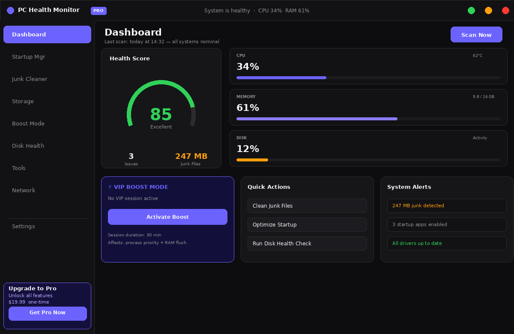

# PC Health Monitor

<div align="center">


**Real-time PC health monitoring and optimization — built to ship internationally.**  
Phase 1: PowerShell 5.1 + WinForms (production-ready) · Phase 2: C# + WPF + .NET 8 (in development)

</div>

---

## Preview

<div align="center">

[](screenshots/PC-Health-Monitor-v2.png)

*Deep Space dark theme — animated health score arc, live CPU/RAM/Disk gauges, VIP Boost Mode, S.M.A.R.T disk health, driver audit, auto-schedule, and more*

</div>

---

## Quick Start

**Option A — One-liner (PowerShell)**
```powershell
irm https://raw.githubusercontent.com/Rzuss/PC-Health-Monitor/main/install.ps1 | iex
```
> Installs to `%LOCALAPPDATA%\PC-Health-Monitor` and creates a Desktop shortcut.

**Option B — Windows Installer (.exe)**  
Download `PC-Health-Monitor-Setup.exe` from the [Releases](https://github.com/Rzuss/PC-Health-Monitor/releases) page.  
No admin required. Includes Start Menu shortcut and Uninstaller.

**Option C — Manual**
```powershell
git clone https://github.com/Rzuss/PC-Health-Monitor.git
cd PC-Health-Monitor
powershell -ExecutionPolicy Bypass -File PC-Health-Monitor.ps1
```

---

## Features

### 🖥️ Real-Time Dashboard
- Live **CPU, RAM, and Disk** usage with GDI+ circular gauge cards
- Auto-refresh every 3 seconds via a **persistent background Runspace** (UI never freezes)
- Live CPU history sparkline (last 60 seconds)
- Status bar with last-updated timestamp and blinking activity dot

### 🏆 Health Score (0–100)
- Composite score updated every 15 seconds across 5 weighted factors:
  - CPU Load (−25 pts) · RAM Usage (−25) · Disk C: (−20) · Startup Apps (−15) · Junk Files (−15)
- Color-coded grade: **Excellent / Good / Fair / Needs Cleanup / Critical**
- Trend arrow (↑ ↓) shows change since last reading
- **(i) info button** opens a popup with full factor breakdown — value · penalty · actionable tip
- Left accent bar dynamically reflects the current score tier

### ⚡ VIP Boost Mode
- Elevates the selected app to **High CPU priority** with one click
- Combo box shows only apps with open windows (services filtered out automatically)
- Configurable session duration (10–120 min) with live countdown timer
- Suspends background services and flushes standby RAM during the session
- **Auto-restores** original priority when session ends, app closes, or monitor exits
- Never uses `RealTime` priority — OS stability is always preserved

### ☠️ Process Manager
- Top 25 processes by RAM — color-coded severity rows
- Anomaly detection per process (Z-score based, persistent history)
- **END button** per row with confirmation dialog
- Protected blacklist: `explorer`, `lsass`, `winlogon`, `csrss`, `dwm` cannot be terminated

### 🚀 Startup Manager
- Lists all programs that launch on boot (User + System registry hives)
- One-click enable/disable with instant registry write
- Impact column: **High / Medium / Low** boot-time cost

### 🗑️ Junk Cleaner
- Scans and removes: Windows Temp, System Temp, Prefetch, Software Distribution cache, Recycle Bin, Thumbnail cache, Browser cache (Chrome / Edge)
- Folder-open button on every row — inspect before you clean
- Size estimate before cleaning; result summary after

### 💾 Storage Analyzer
- Drive overview with used/free bar per volume (SSD/HDD/NVMe detected)
- Top-50 largest files and folders — drill down to reclaim space
- Recursive size calculation runs off the UI thread

### 🔵 Disk Health — S.M.A.R.T.
- Reads S.M.A.R.T. attributes via Windows WMI (no third-party driver needed)
- Displays: model, interface, serial, capacity, temperature, health %
- Highlights critical attributes (reallocated sectors, pending sectors, uncorrectable errors)
- Falls back gracefully when run without admin elevation

### 🔧 Tools
- **Driver Audit** — flags Outdated (>4 yrs) and Aging (>2 yrs) drivers; shows version and date; sorts flagged-only
- **Auto-Schedule Cleanup** — creates a Windows Task Scheduler task via `schtasks.exe` on a configurable interval and time; no external dependencies

### 🌐 Network Monitor
- Active TCP connections with process names and remote addresses
- Adapter overview: IP, MAC, speed, status
- Public IP detection

### 📊 PC Advisor (AI Chat)
- Natural-language intent parser built in pure PowerShell
- Answers system questions: "why is my PC slow?", "should I disable this startup app?"
- Context-aware tips based on live metrics

### ℹ️ Unified (i) Information System
- Every feature tab has a matching **(i)** button (28×28, rounded, blue border)
- Opens a styled dark-theme popup with full feature explanation, use cases, and tips
- Consistent across: Dashboard Score · VIP Mode · Startup · Junk Cleaner · Storage · Disk Health · Driver Audit · Auto-Schedule · Boost Mode

---

## Architecture

```
PC-Health-Monitor.ps1  (Phase 1 — ~4,100 lines, single-file)
│
├── DataEngine Runspace       Background worker: CPU/RAM/Disk metrics every 3 s
├── HardwareService           WMI + PerformanceCounters (CPU temp fallback: powercfg)
├── CleanerService            File enumeration + safe deletion (Temp, Cache, Prefetch…)
├── SchedulerService          Windows Task Scheduler via schtasks.exe
├── DriverService             Win32_PnPSignedDriver — age-based flagging
├── StorageService            DriveInfo + recursive size + WMI S.M.A.R.T.
├── BoostService              Process priority + memory flush (EmptyWorkingSet)
├── NetworkService            TCP connections + adapter info + public IP
│
├── UI Layer (WinForms STA)
│   ├── Tab 1 — Dashboard     Health Score arc, gauge cards, VIP card
│   ├── Tab 2 — Startup Mgr  Registry read/write, impact rating
│   ├── Tab 3 — Junk Cleaner Scan → preview → clean workflow
│   ├── Tab 4 — Storage       Drive bars, top-50 large items
│   ├── Tab 5 — Boost Mode    VIP session, power plan, process priority
│   ├── Tab 6 — Disk Health   S.M.A.R.T. table per disk
│   ├── Tab 7 — Tools         Driver Audit + Auto-Schedule
│   ├── Tab 8 — Network       Connections + adapters
│   └── Tab 9 — PC Advisor   AI chat interface
│
└── PCHealthMonitor-v2/       ← Phase 2 (C# + WPF, in development)
    └── PCHealthMonitor/
        ├── Services/         11 injectable singleton services
        ├── ViewModels/       10 MVVM ViewModels (BaseViewModel + RelayCommand)
        ├── Views/            9 WPF Pages (Dashboard, Startup, Cleaner, …)
        └── Styles/           Deep Space ResourceDictionaries
                              (Colors · Typography · Controls · Animations)
```

---

## Phase 2 — C# + WPF Rewrite

Phase 2 targets international distribution on GitHub, Product Hunt, and app stores.

| Layer | Technology |
|---|---|
| Runtime | .NET 8 (`net8.0-windows`) |
| UI | WPF + XAML |
| Pattern | MVVM — `BaseViewModel` / `RelayCommand` / `AsyncRelayCommand` |
| DI Container | `Microsoft.Extensions.Hosting` |
| Hardware | `LibreHardwareMonitorLib 0.9.3` — CPU temp, fan speed, voltages |
| System Tray | `Hardcodet.NotifyIcon.Wpf 1.1.0` |
| Distribution | `PublishSingleFile + SelfContained` — single `.exe`, no install |
| Business Model | Freemium — Free core · Pro unlock $19.99 one-time |

### Phase 2 Completion Status

| Component | Status |
|---|---|
| Solution + csproj + App entry point | ✅ |
| Deep Space ResourceDictionaries (Colors, Typography, Controls, Animations) | ✅ |
| MVVM foundation (BaseViewModel, RelayCommand, AsyncRelayCommand) | ✅ |
| HardwareService — CPU/RAM/Disk/Temp + 2 s DispatcherTimer | ✅ |
| MainWindow — custom chrome, sidebar nav, system tray | ✅ |
| DashboardView — animated arc gauge, mini gauges, VIP card, alerts | ✅ |
| All 9 feature Views + 10 ViewModels | ✅ |
| All 11 Services (Cleaner, Storage, Driver, Scheduler, Boost, Network…) | ✅ |
| BoolToVisibility converters + CommandExtensions | ✅ |
| GPU monitoring | 🔄 Phase 2.1 |
| Sparkline chart control | 🔄 Phase 2.1 |
| GitHub Actions publish pipeline | 🔄 Phase 2.1 |

---

## Changelog

### 2026-04-24 — Hotfixes
- **fix:** Power plan `Get-CimInstance` throws HRESULT `0x80070668` in Terminal Services sessions — added `-ErrorAction Stop` to make CimException terminating, plus `powercfg /list` fallback that requires no WMI rights
- **fix:** `New-InfoBtn` null parent crash — 4 here-string closings had `\$parent` (literal string) instead of `$parent` (variable). String is truthy so the guard passed, but `.Controls` returned null → `InvokeMethodOnNull`

### 2026-04-15 — Phase 2 Scaffold
- C# + WPF project scaffolded: solution, csproj, App.xaml, all services, all ViewModels, all Views
- Deep Space theme ported to WPF ResourceDictionaries
- Freemium model designed: free core + $19.99 Pro activation

### 2026-04-14 — Phase 1 UI Audit
- Unified **(i)** information buttons across all 9 feature tabs
- Fixed `Show-ScoreInfo` color null errors (WinForms event scope isolation)
- Fixed Driver Audit emoji rendering artifacts (removed Icon column)
- VIP status label and score subtitle visibility fixes (`$C.Dim` → `$C.SubText`)

---

## Requirements

| | Phase 1 | Phase 2 |
|---|---|---|
| OS | Windows 10 / 11 | Windows 10 / 11 |
| Runtime | PowerShell 5.1 (built-in) | .NET 8 (bundled) |
| Admin | Optional | Optional |
| Disk | ~1 MB | ~85 MB (self-contained) |
| Dependencies | None | None |

---

## Security & Privacy

- **Zero telemetry** — no data leaves your machine, ever
- **No registry persistence** unless Auto-Schedule is explicitly enabled
- **Read-only by default** — scan operations never modify system files
- **Dry-run safe** — all destructive operations require explicit user confirmation
- Fully open-source — every line of code is auditable in this repository

---

## License

MIT © 2025 Rotem. See [LICENSE](LICENSE) for full text.

---

<div align="center">

**[⭐ Star this repo](https://github.com/Rzuss/PC-Health-Monitor)** if it saved you time — it funds continued development.

</div>
